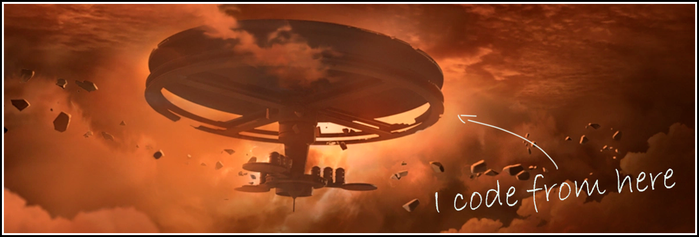

♨️ **I am a co-founder of the Cape4labs.** Together, we have built solutions in areas such as blockchain privacy, on-chain data crowdsourcing, and decentralized finance. You can find more details here — [Github](https://github.com/cape4labs). I contributed to Cape4labs team projects mainly as a technical writer, project manager, and concept designer, and much less as a developer. Right now, I am changing that and learning Solidity. 

⭕ **My career focus is DAOs.** I love the idea of on-chain governance, and it aligns with my philosophical views. I am trying to build several initiatives in this field and I know I will succeed soon. I love science fiction, and for me, blockchain technologies are a way to build the world we once only dreamed about.

