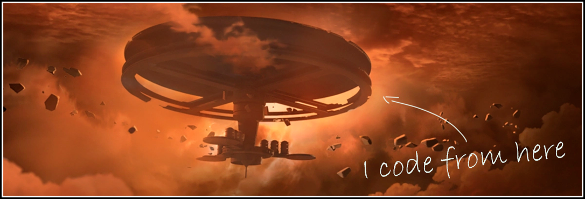

♨️ **I am a co-founder of the Cape4labs:** 

Together, we have built solutions in areas such as blockchain privacy, on-chain data crowdsourcing, and decentralized finance. You can find more details here - [Github](https://github.com/cape4labs). There, I share the roles of both Product Manager and Solidity Engineer.

⭕ **My career focus is DAOs:** 

I love the idea of on-chain governance so much. I hope one day I will be part of a new DAO rise. I love science fiction, and for me, blockchain technologies are a way to build the world we once only dreamed about.

