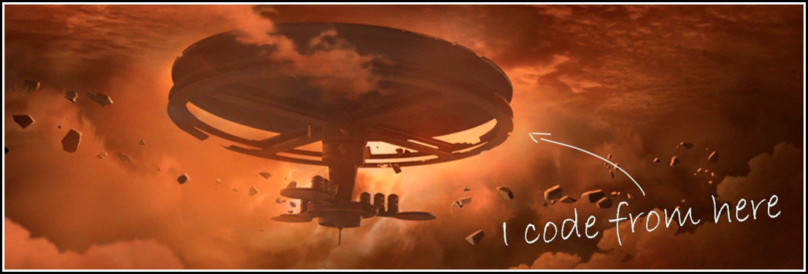

♨️ **I am an ex co-founder of the Cape4labs:** 

Sounds epic, but let’s keep it simple: we were a team of four building solutions in areas such as blockchain privacy, on-chain data crowdsourcing, and decentralized finance. Sometimes we succeeded, more often we failed. You can find more details here - [Github](https://github.com/cape4labs). I worked there as both a Product Manager and a Solidity Engineer. I am no longer a part of the team as I’ve switched to solo mode, mainly to have more time for learning.

⭕ **My career focus is DAOs, Public Goods and Privacy:** 

I love the idea of on-chain governance and shared digital goods. I want everyone to have access to fair voting and a fair, decentralized Internet where you can stay private no matter who you are and what you are devoted to. I love science fiction, and for me, blockchain technology is a way to build the world we once could only dream about.

